先上图


## 引入Mermaid

在 `head` 中加入css:

```html
<link rel="stylesheet" href="//unpkg.com/mermaid/dist/mermaid.min.css">
```

在 底部 引用js:

```html
<script type="text/javascript" src="//unpkg.com/mermaid/dist/mermaid.min.js"></script>
```

## 配置文件修改

```js
window.$docsify = {
  // ...
  plugins: [
    function(hook, vm) {
      hook.ready(function () {
        mermaid.initialize({startOnLoad: false});
      });
      hook.doneEach(function () {
        mermaid.init(undefined,'.mermaid');
      });
    }
  ],
  markdown: {
    renderer: {
      code: function(code, lang) {
        var html = '';
        if(code.match(/^sequenceDiagram/) || code.match(/^graph/) || code.match(/^gantt/)){
          html = '<div class="mermaid">' + code + '</div>';
        }
        var hl = Prism.highlight(code, Prism.languages[lang] || Prism.languages.markup)
        return html + '<pre v-pre data-lang="' + lang + '"><code class="lang-' + lang + '">' + hl + '</code></pre>'
      }
    }
  }
}
```

解释一下,两个关键步骤:

### markdown代码解析器

```js
markdown: {
  renderer: {
    code: function(code, lang) {
    var html = '';
    // 搜索 mermaid 代码
    if(code.match(/^sequenceDiagram/) || code.match(/^graph/) || code.match(/^gantt/)){
      // 生成一个 mermaid 图表的容器
      html = '<div class="mermaid">' + code + '</div>';
    }
    // 源码自带的 Prism 高亮插件
    var hl = Prism.highlight(code, Prism.languages[lang] || Prism.languages.markup)
    // 将图表的容器添加到代码之前
    return html + '<pre v-pre data-lang="' + lang + '"><code class="lang-' + lang + '">' + hl + '</code></pre>'
    }
  }
}
```

### 自定义插件

```js
plugins: [
  function(hook, vm) {
    hook.ready(function () {
      // 类似 jQuery.ready 初始化 mermaid, 禁用自动渲染
      mermaid.initialize({startOnLoad: false});
    });
    hook.doneEach(function () {
      // 每个页面渲染完成后手动渲染 mermaid 图表
      mermaid.init(undefined,'.mermaid');
    });
  }
]
```


最后再补一张甘特图:


Mermaid支持:

- 流程图
- 序列图
- 甘特图

而且语法结构非常简单,值得推荐.

## 其实,正文才刚刚开始.

### 流程图

#### 开始/结束


#### 过程

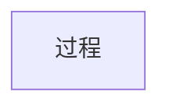

#### 输入/输出

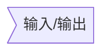

#### 判断

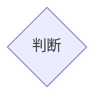

#### 连接线

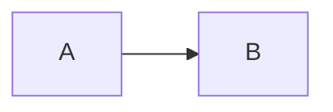

#### 自定义样式

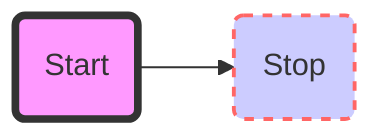

#### 示例

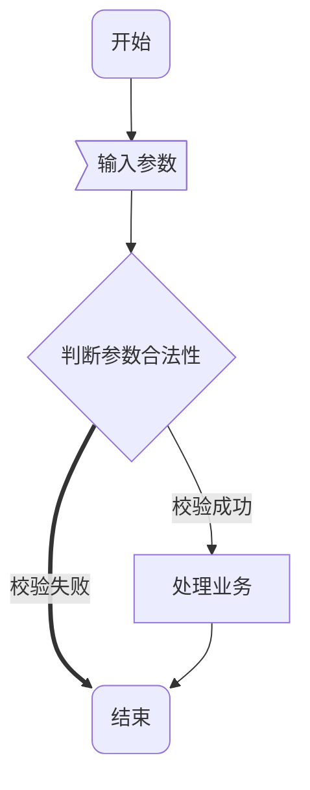

#### 子图

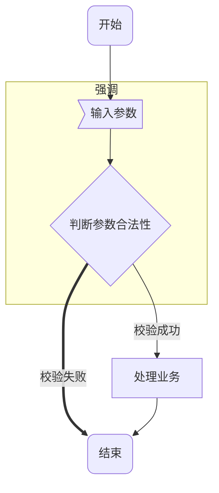

### 时序图

#### 参与者

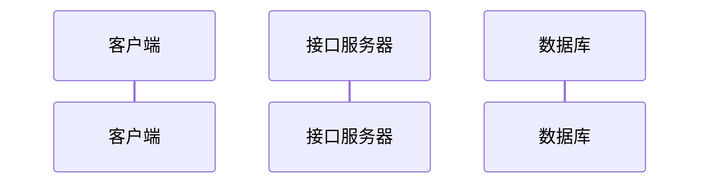

#### 消息

##### 消息格式

```
[参与者][箭头][参与者]:消息内容
```

支持的箭头有:

| 类型 | 说明     |
|:---:|----------|
| ->  | 无箭头实线 |
| --> | 无箭头虚线 |
| ->> | 箭头实线  |
| -->>| 箭头虚线  |
| -x  | 箭头实线带x(异步) |
| --x | 箭头虚线带x(异步) |

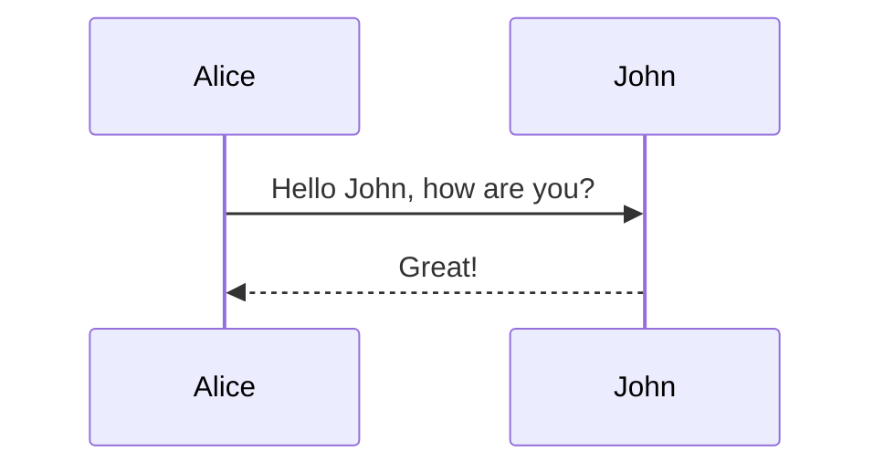

#### 激活

用 `+/-` 符号

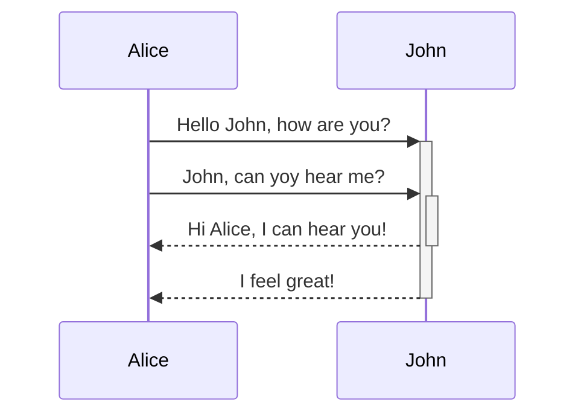

### 甘特图

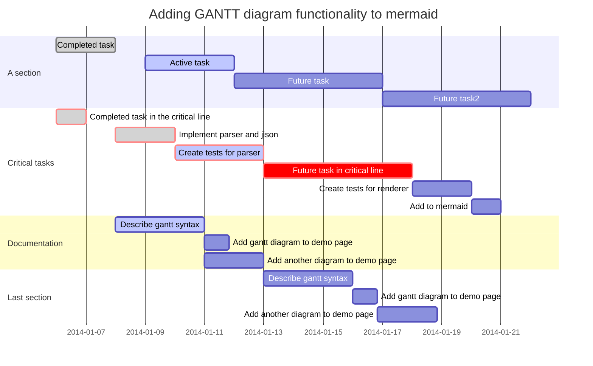

## 在线编辑器

 <https://knsv.github.io/mermaid/live_editor/>
